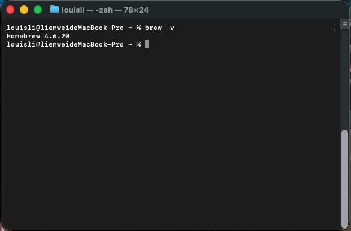
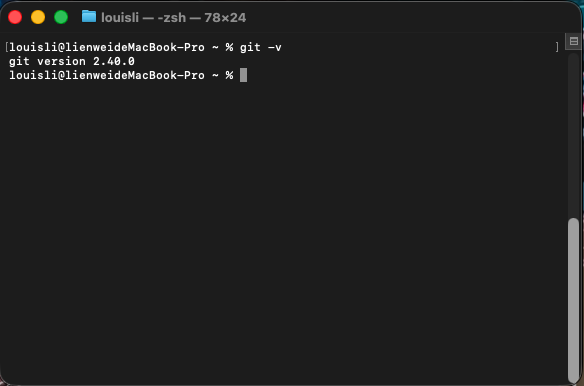

# Mac安裝Git的說明

---

1. 先連到Git官網的[說明頁面](https://git-scm.com/install/mac)
2. 打開電腦的Terminal(終端機)
3. 在Terminal輸入以下指令確認是否安裝Homebrew

     ```bash
     brew -v
     ```

    如果沒有顯示類似下面的訊息，表示你沒有安裝Homebrew，可參考[官方文件](https://brew.sh/zh-tw/)進行安裝，或者執行下面這張圖底下的指令也可以安裝。

    

    ```bash
    /bin/bash -c "$(curl -fsSL https://raw.githubusercontent.com/Homebrew/install/HEAD/install.sh)"
    ```

4. 參考Git官網的說明，執行以下指令安裝Git

    ```bash
    brew install git
    ```

5. 執行完畢，將Termina關掉重開，輸入以下指令確認是否安裝Git

    ```bash
    git -v
    ```

    
